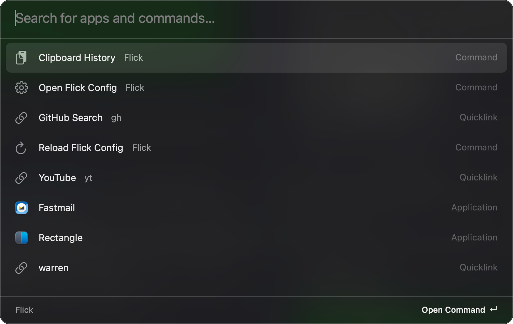
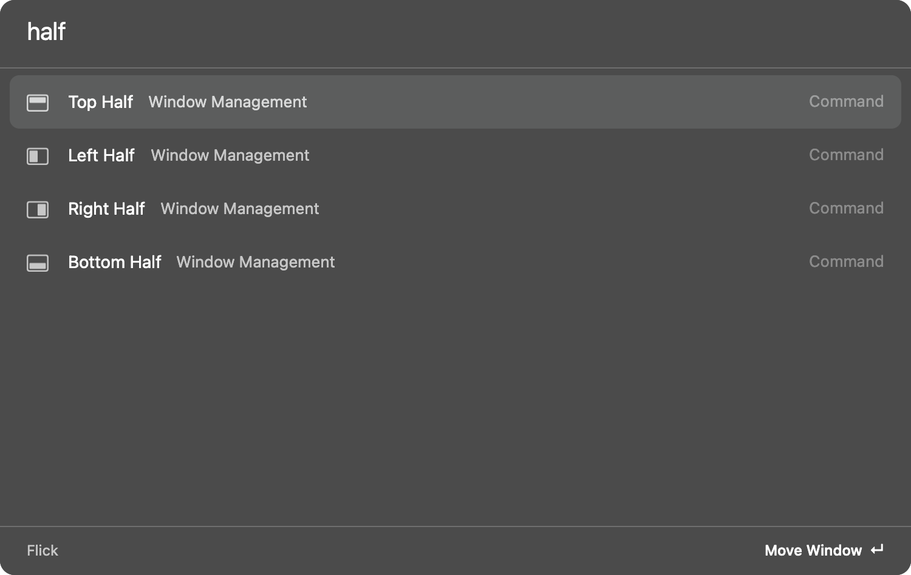
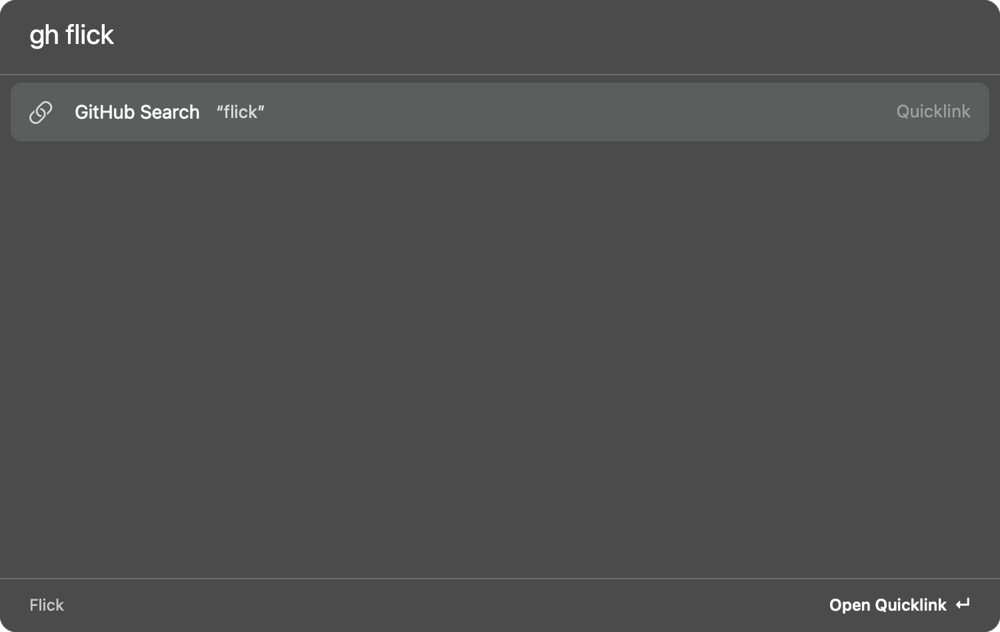

<div align="center">


[](https://github.com/jayminwest/flick/actions/workflows/ci.yml)
[](https://github.com/jayminwest/flick/releases)
[](LICENSE)

**[Quickstart](#quickstart)** · **[Configuration](#configuration)** · **[Keys](#keys)** · **[Roadmap](#roadmap)**

</div>

# Flick

## A keyboard-first launcher and window manager for macOS.

Flick replaces a launcher, a window snapper, and a window switcher with one small native app. It is Rust on AppKit: no web view, no JavaScript runtime, no account, no network calls of its own. The app is about 3,200 lines of Rust, not counting tests, and a binary under 4 MB.

<p align="center">
  
</p>

## Why

Raycast, Rectangle, and AltTab each own one hotkey and one background process. Flick puts the parts you use every day behind one config file that you can keep in your dotfiles:

```text
⌃Space ──► launcher ──┬── apps (fuzzy, learns from use)
                      ├── quicklinks ("g rust" searches Google)
                      ├── clipboard history
                      └── window commands
⌘Space ──► window switcher ──► any window, any desktop
⌘`     ──► other desktop
Hyper+HJKL ──► snap windows (repeat to cycle 1/2 → 2/3 → 1/3)
```

## What Flick does

- **Launcher.** Fuzzy search over apps and commands. Acronyms match (`vsc` finds Visual Studio Code). Results you pick often rank higher, with a 14-day half-life.
- **Window management.** Halves, quarters, thirds, two-thirds, maximize, almost maximize, center, minimize, hide, next and previous display. Bind any of them to a global hotkey. Repeating a half cycles its size, as Rectangle does.
- **Window switcher.** Fuzzy search over open windows by title and app. The first result is the previous window, so the hotkey and ↵ jump back. Apps on other desktops show as one entry that switches desktops.
- **Desktop toggle.** One hotkey jumps to the most recent app on another desktop. Built for a full-screen terminal on one desktop and everything else on another.
- **Clipboard history.** The last 500 text clips, searchable. ↵ pastes into the previous app. Flick skips content that password managers mark as concealed.
- **Herdr agents.** Coding agents in herdr on this Mac and on herdr's saved SSH machines, the ones waiting on you first. ↵ jumps to the agent's pane; a notification tells you when one starts to wait.
- **Screenshots and drawing.** Capture an area, a window or a screen to a PNG file and the clipboard, mark it up with arrows, boxes, a pen, a highlighter, text and redaction, and draw on the screen with a cursor halo. It replaces Shottr and Presentify.
- **Quicklinks.** URLs and paths with an optional `{query}` argument. Type `<keyword> <text>` to run one from the root search. Import your Raycast quicklinks with one command.

## See it

| | |
|---|---|
|  |  |
| *Window commands: type a few letters, or bind them to hotkeys* | *Quicklinks: `gh flick` searches GitHub from the root* |

## Quickstart

Flick needs macOS 13 or later and a Rust toolchain.

```bash
git clone https://github.com/jayminwest/flick
cd flick
./scripts/bundle.sh --install
```

The script builds `~/Applications/Flick.app` and starts it. Press `⌥⇧Space` to open the launcher.

Window management, the window switcher, and auto-paste need Accessibility permission. macOS asks the first time you use one of them. Turn Flick on in **System Settings → Privacy & Security → Accessibility**.

> [!NOTE]
> The script signs Flick with your Apple Development certificate when you have one. With that identity, macOS keeps the Accessibility permission across rebuilds. Without one, the script signs ad hoc, and macOS asks again after each rebuild.

### Prebuilt app

Each [release](https://github.com/jayminwest/flick/releases) has an Apple Silicon build. It is not notarized, so remove the quarantine flag after you unzip it:

```bash
xattr -dr com.apple.quarantine Flick.app
mv Flick.app ~/Applications/
```

### Launch at login

Add Flick to **System Settings → General → Login Items**. With nix-darwin and home-manager, use a launchd agent:

```nix
launchd.agents.flick = {
  enable = true;
  config = {
    ProgramArguments = [ "/Users/you/Applications/Flick.app/Contents/MacOS/Flick" ];
    RunAtLoad = true;
    KeepAlive.SuccessfulExit = false; # restart on crash; "Quit Flick" stays quit
    ProcessType = "Interactive";
  };
};
```

`bundle.sh --install` and the in-app rebuild install through `scripts/relaunch.sh`. It copies the new bundle next to the old one, checks its signature, and swaps the two with renames, so a failed install leaves the old app in place. Then it stops Flick, waits until the old process exits, and starts Flick through this agent when it exists (`launchctl kickstart -k`), else with `open`.

### Rebuild from the checkout

Flick can rebuild itself from the local clone it was built from. It does not fetch, pull or push: it builds the commits that are already in the checkout.

- **Flick Version** shows the installed commit and build time, and how many commits the checkout is ahead, with their subjects. Flick checks the checkout with local git commands when the launcher opens, at most once per 30 s.
- **Rebuild Available** shows when the checkout's `HEAD` is not the installed commit.
- **Rebuild Flick** exports `HEAD` with `git archive` and builds that, so uncommitted edits stay out. **Rebuild Flick (Dirty)** builds the tree as it is, and the version ends in `-dirty`.

A rebuild runs in the background. The build view shows the elapsed time and the last log line, with **Cancel Build** and **Open Build Log**. When the build succeeds, Flick installs the new app and restarts. When it fails, Flick opens the log, and the installed app and the running process do not change. Flick never rebuilds by itself.

```bash
flick flick version                    # installed sha, build time, clean or dirty; the checkout's HEAD
flick flick rebuild                    # build HEAD; prints the log path and returns at once
flick flick rebuild --dirty            # build the tree as it is
flick flick rebuild --ref my-branch    # build another local rev
flick flick status                     # idle, building <n>s, installing, installed, failed or cancelled
flick flick cancel                     # stop the build that runs
```

Details:

- The build runs `scripts/bundle.sh` with `cargo build --release --locked --offline` through your login shell (`$SHELL -lc`), so `cargo` must be on your login-shell `PATH`. If it is not, the build fails with "cargo not found on login-shell PATH".
- The build is offline. If the checkout needs a crate that cargo has not downloaded, the build fails with a hint: run `cargo fetch` in the checkout, then rebuild.
- Compiled output goes to `<checkout>/target/flick-rebuild`, apart from `target/`, so a rebuild does not wait on other cargo commands. It takes about 1 GB; `cargo clean --target-dir target/flick-rebuild` removes it. The exported tree is in `~/Library/Caches/Flick/rebuild`.
- The log is `~/Library/Logs/Flick/rebuild.log`. The log of the build before it is `rebuild.log.1`.
- `--source <dir>` builds another checkout or worktree, for example an agent's worktree, to try it before you merge it. The installed app then records that directory as its checkout, so **Flick Version** and **Rebuild Available** compare against it until you rebuild from the main checkout (flick-be14).
- Without an Apple Development identity the bundle is signed ad hoc, and macOS asks for Accessibility again after each rebuild.

## Configuration

Flick reads `~/.config/flick/config.toml` and writes a commented default on first run. Set `FLICK_CONFIG` to use a different path. Run **Reload Flick Config** from the launcher after you edit it.

```toml
hotkey = "ctrl+Space"              # launcher

[switcher]
hotkey = "cmd+Space"               # window switcher

[desktop]
hotkey = "cmd+Backquote"           # most recent app on another desktop

[window.keys]
# Hyper (cmd+ctrl+alt+shift): Caps Lock with [keys] hyper, see Key triggers
left-half = "cmd+ctrl+alt+shift+KeyH"
right-half = "cmd+ctrl+alt+shift+KeyL"
maximize = "cmd+ctrl+alt+shift+KeyK"
hide = "cmd+ctrl+alt+shift+KeyJ"
next-display = "cmd+ctrl+alt+shift+KeyN"
previous-display = "cmd+ctrl+alt+shift+KeyP"

[[quicklink.links]]
name = "GitHub Search"
keyword = "gh"
url = "https://github.com/search?q={query}&type=repositories"

[[quicklink.links]]
name = "Projects"
url = "~/Projects"
```

Each module reads its own table: `app`, `desktop`, `switcher`, `window`, `quicklink`, `builtin`, `clip`, `activity`, `task`, `keys`, `capture`, `flick`. Set `enabled = false` in a table to turn that module off. Config files from older versions keep working: the flat keys `windows_hotkey`, `desktop_toggle`, `[window_keys]` and `[[quicklinks]]` still apply.

Hotkeys use `cmd`, `alt`, `ctrl`, and `shift` with key names such as `Space`, `KeyA`, `Digit1`, `ArrowLeft`, and `Backquote`. Window action names are the command titles in kebab case: `top-left-quarter`, `first-two-thirds`, `almost-maximize`.

> [!WARNING]
> A global hotkey overrides that shortcut in every app. For example, `cmd+KeyL` would replace the browser address bar. A Hyper key (`cmd+ctrl+alt+shift`) avoids conflicts.

### Key triggers

The `keys` module replaces Hyperkey and small Hammerspoon configs. It turns one key into Hyper, and runs an action when a set of keys goes down and again when it comes up (push-to-talk). It is off until you add a `[keys]` table: with no table, Flick creates no key tap and does not remap Caps Lock.

```toml
[keys]
hyper = "caps_lock"                # Caps Lock adds hyper_mods to keys held with it
hyper_mods = "cmd+ctrl+alt+shift"  # the default
hyper_tap = "Escape"               # a tap shorter than hyper_tap_ms sends this; "" for nothing
hyper_tap_ms = 300

[[keys.chord]]
name = "ptt"
keys = ["right_cmd", "right_alt"]  # modifiers plus at most one other key
on_down = { http = "POST http://localhost:8600/pipeline/listen/start" }
on_up = { http = "POST http://localhost:8600/pipeline/listen/stop" }
```

- **Hyper.** While the hyper key is held, Flick adds `hyper_mods` to each key event, so `[window.keys]` bindings such as `cmd+ctrl+alt+shift+KeyH` fire. `hyper = "caps_lock"` remaps Caps Lock to F18 with `hidutil`, so Caps Lock never toggles uppercase; any other key name (for example `hyper = "F18"`) uses that key and skips the remap.
- **Chords.** Key names: `cmd`, `alt`, `ctrl`, `shift` (either side), `left_cmd`, `right_cmd`, `left_alt`, `right_alt`, `left_ctrl`, `right_ctrl`, `left_shift`, `right_shift`, `fn`, and one hotkey key name such as `KeyA` or `F13`. A sided name does not match the other side. Modifiers pass through to apps; a chord's other key does not type. Key repeat never fires a chord again.
- **Actions.** `{ http = "[METHOD ]http://host[:port]/path" }` sends one request with an empty body (method defaults to `POST`; `http://` only, 2 s timeout). `{ shell = "..." }` runs `/bin/sh -c` with `FLICK_CHORD=<name>` and `FLICK_CHORD_STATE=down|up`. Actions run in order on one worker thread, so an `up` never overtakes its `down`.
- **Events.** Each edge is also an event: `flick events` prints `{"event":"chord","index":0,"down":true}`.

```bash
flick keys list                # <index>\t<name>\t<keys>\tdown: <action>\tup: <action>, then hyper
flick keys status              # key tap, secure input, Caps Lock remap, conflicts
flick keys fire ptt down       # run a chord's action without the keyboard
```

`flick keys status` reports conflicts: Hyperkey running with `hyper = "caps_lock"` (two remaps of one key), Hammerspoon running with a chord configured (its taps may run the same chord), a global hotkey on the hyper key (the tap swallows it), and a chord key that is also a global hotkey. The startup log lists the same conflicts, but it misses hotkey conflicts, because hotkeys bind after the key tap starts.

Limits:

- The key tap needs Accessibility. Without it, `flick keys status` says `Accessibility needed`, and with `hyper = "caps_lock"` Caps Lock does nothing (it sends F18) until you grant it. Flick retries every 5 s, so a grant needs no restart.
- Secure input (password fields, Terminal's Secure Keyboard Entry) hides key presses from the tap: Hyper and chords with a non-modifier key pause there. Modifier-only chords still work.
- Flick clears the Caps Lock remap when it quits through **Quit Flick** or SIGTERM (launchd stop, `kill`). It handles SIGTERM itself only after it has set the remap; before that, SIGTERM ends Flick at once, with nothing to clear. After a crash, Caps Lock stays F18 until Flick starts again. At start, Flick clears its own entry if `hyper` is no longer `caps_lock` (or `[keys]` is gone), and leaves other `hidutil` mappings alone. To reset every mapping by hand:

  ```bash
  hidutil property --set '{"UserKeyMapping":[]}'   # clears every hidutil key mapping
  ```

[docs/keys.md](docs/keys.md) has the steps to move from Hyperkey and Hammerspoon, and a manual test checklist.

### Activity

The `activity` module records which app is in front, as time spans, and reports where your day went. It replaces trackers such as Rize, and it keeps the data on this Mac.

Recording is off until you turn it on: run **Start Activity Recording** from the launcher, `flick activity on`, or the optional hotkey. While it records, a `●` shows in the menu bar; its menu has **Stop Recording**. The on/off state survives reloads and restarts. **Activity Today** in the launcher shows today's totals.

```toml
[activity]
titles = false                     # the default; true also stores window titles
urls = false                       # the default; true also stores the browser's front tab URL
remote_urls = false                # agent sessions see URLs and domains only when true
exclude = ["com.1password.1password", "com.agilebits.onepassword7", "com.apple.keychainaccess"]
hotkey = "cmd+ctrl+alt+shift+KeyR" # toggles recording; unbound by default
merge_secs = 2                     # a span shorter than this is dropped when focus moves on (alt-tab)

[[activity.rules]]                 # report-time grouping; the first match wins
app = "wezterm|zed"                # regex on the bundle id or app name, any case
title = "flick"                    # optional regex on the window title
project = "flick"
category = "code"
```

```bash
flick activity status              # recording, titles, urls, the open span
flick activity today               # totals by category, project, app, title and domain; `week` for 7 days
flick activity today --by task     # totals per running task id (see `flick task ls`)
flick activity spans --since 2026-10-01   # <start>\t<duration>\t<app>\t<bundle id>\t<title>[\t<url>]
flick --json activity today | jq .ok.by_app
flick activity forget today --yes  # also: forget all --yes, forget app <bundle id> --yes
```

Privacy:

- **What.** Each span is a start, an end, the app's bundle id and name and, only with `titles = true`, the focused window's title (spinner glyphs stripped, at most 256 characters). With `titles = false` Flick never reads a title and installs no Accessibility observer. Titles need Accessibility; without it `flick activity status` says `titles: no Accessibility permission` and spans stay per app.
- **URLs.** Only with `urls = true`, a span in Brave, Chrome, Edge or Chromium also stores the front tab's URL (at most 2048 characters), and reports list the top domains. Flick asks the browser through AppleScript when it comes to the front or its window or title changes (the window is followed as for titles, so tab switches need Accessibility too). A private (incognito) window gives no URL. Safari and Arc are not supported: Flick cannot tell their private windows. Each browser asks once for Automation permission; if you deny it, `flick activity status` says `urls: no Automation permission for Brave Browser` and its spans have no URL (allow it again in System Settings > Privacy & Security > Automation). URLs keep their query strings, which can hold tokens; `exclude` the browser or leave `urls` off if that matters.
- **Not recorded.** Apps in `exclude` (matched by bundle id or name) leave a gap, not a row. Setting `exclude` replaces the default list, so keep the password managers in it. Idle time (60 s without input; the span ends at the last input), a locked screen and sleep are not recorded either.
- **Where.** Tables `activity_spans` and `activity_state` in `~/Library/Application Support/Flick/flick.db`. The module has no network code. The only way in from outside is the mode-0600 control socket.
- **Delete.** `flick activity forget today|all|app <bundle id> --yes`. `forget all` empties both tables, turns recording off and runs `VACUUM`, so the rows leave the file. Data stays until you delete it.
- **Rules** apply when a report runs and are never stored, so a rule edit regroups past spans too.

Limits: idle detection runs every 5 s, so it can lag by that much, and a long video with no input counts as idle. A crash loses the time since the last event. Quit (**Quit Flick**, SIGTERM from launchd or `kill`) closes the open span. [docs/activity.md](docs/activity.md) has a manual test checklist.

### Tasks

The `task` module keeps a short task list (title, optional project, status `todo`, `doing` or `done`) and times the one task that runs. It has no subtasks, estimates, due dates or sync. Tasks and their time stay in `flick.db` on this Mac.

In the launcher, **Start Task** opens a picker of the tasks not done. Type to filter; ↵ starts the selected task. If no task has the typed title, the first row is **Start new task "<title>"**. A trailing `#word` sets the project of the new task and filters the list to that project: `Review PR #kota`. While a task runs, root search shows **Stop Task: Review PR · 0:42** (time today) and **Switch Task**. **Tasks Today** shows today's totals per task and per project. On a task row, ⌘K has **Start Task**, **Mark Done** and **Stop Task**.

```toml
[task]
hotkey = "cmd+ctrl+alt+shift+KeyT" # opens the task picker; unbound by default
```

```bash
flick task start "Write plan" --project flick  # a title that matches no task creates it
flick task switch 3                # same as start: the running task stops, task 3 runs
flick task stop
flick task ls                      # todo and doing tasks, ▶ marks the running one; --all adds done
flick task add "Review PR" --project kota
flick task done 3                  # stops it if it runs; done tasks leave ls but stay in reports
flick task report week             # also today (the default), 2026-10-01, 2026-10-01..2026-10-07; --project P
flick --json task ls | jq .ok.running.id
flick --json task report today | jq .ok.total_secs
```

`<id|title>` is a task id, an exact title, or a case-insensitive prefix that matches only one task. A prefix that matches several tasks is an error that lists them. Report days are local days; a week is Monday to Sunday.

- **Timer.** At most one task runs. It keeps running through `flick reload` and a restart; the time Flick was not running does not count. Idle (60 s without input) ends the task's time at the last input, and the next input starts it again. Sleep and screen lock pause it at once; wake and unlock resume it. A crash loses the time since the last event. Quit (**Quit Flick**, SIGTERM) ends the open time row. There is no ticking timer: durations are computed when a list or command reads them.
- **Activity.** Task timing works with activity recording off. While recording is on, each activity span carries the id of the task that ran: `flick activity today --by task` gives totals per task id. For the apps used per task, filter the spans: `flick --json activity spans --since today | jq '.ok[] | select(.task == 3)'`.
- **Events.** Each start, switch and stop, and the task restored at startup, is an event: `flick events` prints `{"event":"task_changed","task":3}` (`"task":null` after a stop).

[docs/tasks.md](docs/tasks.md) has a manual test checklist.

### Herdr

The `herdr` module lists the coding agents (claude, pi, codex, ...) that run in herdr, on this Mac and on the machines in `herdr machine list`. **Herdr Agents** in the launcher shows one row per agent: blocked first (an approval or a question waits on you), then done, idle and working. ↵ focuses the agent's herdr pane and brings the terminal to the front. ⌘K **Show Output** shows the agent's last lines. Flick only reads and focuses; it never sends input to an agent.

```toml
[herdr]
machines = ["local", "mbp-server"] # default []: local plus every enabled `herdr machine list` profile
remote_refresh_secs = 60           # default 0: remote machines refresh only while the launcher is open
terminal = "WezTerm"               # the app brought to the front on a jump
hotkey = "cmd+ctrl+alt+shift+KeyA" # opens the agents view; unbound by default
preview_lines = 6                  # lines in Show Output (1 to 40)
notify = ["blocked", "done"]       # default ["blocked"]; [] for no notifications
```

```bash
flick herdr ls                     # <machine>/<pane id>  <status>  <name>  <cwd · title>, waiting first
flick herdr jump mbp-server/w1:p2  # or <machine>/<agent name>
flick herdr status                 # per machine: live or polled, last read, error; notifications
flick --json herdr ls | jq '.ok.machines | keys'
```

- **What is read.** The local herdr server streams agent status over its socket (`~/.config/herdr/herdr.sock`), so local changes show within a second. Remote machines go through `herdr --machine <label>`, which uses herdr's own SSH profiles; Flick has no SSH code. herdr has no remote event stream, so remote machines are polled: every 15 s while the launcher is open, and every `remote_refresh_secs` when set. A machine that does not answer shows as a row with its error and the time of the last good read.
- **Nothing stored.** Agent lists and output stay in memory. Nothing goes to `flick.db` or the log. Only the root item `herdr:agents` has a usage row.
- **Notifications.** When an agent enters a status in `notify`, Flick posts one macOS notification: the agent's name, machine, cwd and terminal title, never its output. A click jumps to the agent. There is none for the first read of a machine, for a status that repeats, or for an agent whose pane is focused while the terminal is in front. Notifications need Flick.app (macOS asks for permission on the first launch); `cargo run` posts nothing, and `flick herdr status` says why.

[docs/herdr.md](docs/herdr.md) has a manual test checklist.

### Capture

The `capture` module takes screenshots, opens them in a small annotation editor, and draws on the screen. It replaces Shottr and Presentify. Shots go through macOS's own `screencapture`, so the selection is the native one: a crosshair, Space for a window, Esc to cancel, every display, Retina pixels.

| Launcher item | What it does |
|---|---|
| **Capture Area** | Drag to select; Space picks a window instead; Esc cancels and saves nothing. |
| **Capture Window** | Click a window. With `shadow = true` the PNG keeps the window shadow. |
| **Capture Screen** | The whole display under the mouse. |
| **Capture Area and Annotate** | Capture Area, then the editor opens on the shot. |
| **Draw on Screen** / **Stop Drawing on Screen** | Draw over every app and every display. |
| **Highlight Cursor** / **Stop Highlighting Cursor** | A ring follows the pointer and pulses on a click. |
| **Clear Drawing** | Remove the shapes from the screen. Shows only while shapes are there. |
| **Recent Captures** | Your shots, newest first. ↵ opens one. ⌘K: **Copy Image**, **Annotate**, **Show in Finder**, **Copy Path**, **Move to Trash**. |

Editor and draw keys: `a` arrow, `r` rectangle, `p` pen, `h` highlighter, `t` text, `x` redact (a solid black box), `1` to `5` the colors, ⌘Z undo, ⇧⌘Z redo, Delete clears.

- **Editor.** ↵ writes the annotated PNG at full pixel size, and copies it when `copy = true`. ⌘C writes and copies; ⌘S writes and does not copy. Esc or the close button writes nothing. The app you came from is in front again after the editor closes. **Capture Area and Annotate** writes over the shot; **Annotate** in Recent Captures and `flick capture annotate` write `<name> annotated.png` beside the file, and that copy shows in Recent Captures.
- **Draw on Screen.** Drawing starts with the pen. ↵ stops drawing and keeps the shapes on the screen; clicks then pass through to the apps under them. Esc stops drawing and clears the shapes. With `fade_secs` above 0, each shape fades after that many seconds.

```toml
[capture]
dir = "~/Pictures/Flick"           # created on the first save
name = "Flick {date} at {time}.png"  # also {kind}: area, window, screen, display, rect
copy = true                        # put each shot on the clipboard
save = true                        # false: clipboard only (save and copy cannot both be off)
sound = true                       # the shutter sound
cursor = false                     # include the mouse pointer
shadow = true                      # window shadows in Capture Window
history = 200                      # rows in Recent Captures; trimming never deletes files
colors = ["#ff3b30", "#ffcc00", "#34c759", "#0a84ff", "#ffffff"]  # keys 1-5; #rrggbb or #rrggbbaa
width = 4.0                        # pen width in points
fade_secs = 0.0                    # draw on screen: 0 keeps shapes until Esc or Clear Drawing
halo_color = "#ffcc00"
halo_radius = 28.0
area_hotkey = "cmd+ctrl+alt+shift+Digit4"  # area, window, screen, annotate, draw and cursor
draw_hotkey = "cmd+ctrl+alt+shift+KeyD"    # hotkeys are all unbound by default
```

```bash
flick capture area                 # starts the selection and answers "Select an area" at once
flick capture area --annotate      # also: window, window --annotate
flick capture screen               # the display under the mouse; prints the file path
flick capture display 2            # display 2, main display first
flick capture rect 0,0,400,300 --no-copy   # x,y,w,h in points from the top left
flick capture screen --out /tmp/shot.png   # --out needs an absolute path
flick --json capture screen | jq .ok.path  # {"path","width","height","copied"}
flick capture ls --limit 5         # <id>\t<path>\t<w>x<h>, newest first; --json: rows
flick capture last                 # the newest file
flick capture draw on              # on|off|toggle|clear
flick capture cursor toggle        # on|off|toggle
flick capture annotate ~/Desktop/shot.png  # opens the editor; prints the copy's path
```

`screen`, `display` and `rect` answer when the file is written. `area` and `window` answer at once; the shot lands in Recent Captures when you finish the selection.

- **Screen Recording.** Flick needs the Screen Recording permission (System Settings → Privacy & Security → Screen & System Audio Recording). Without it, macOS gives back only the wallpaper and Flick's own windows, so Flick does not capture: the first try shows `Allow Screen Recording for Flick in System Settings` and opens the system prompt. Quit and restart Flick after you allow it. macOS 15 and later also asks again from time to time whether Flick may keep recording the screen; that prompt is from macOS, and Flick keeps working when you allow it. An ad hoc signed rebuild can lose the grant, as with Accessibility.
- **Where files go.** `dir`, named from `name`; a taken name gets ` (2)`, ` (3)` and so on. `--out <path>` writes there instead. With `save = false` the shot is a file in `$TMPDIR/flick-capture`, is on the clipboard, and does not show in Recent Captures; Flick does not delete those files, macOS clears the temp folder.
- **What is stored.** Table `capture_shots` in `flick.db` holds each shot's path, kind, size and time, never the image. A row whose file is gone drops out of Recent Captures.
- **Trash.** **Move to Trash** asks first (⌘↵ confirms), moves the file to the macOS Trash (Finder's Put Back restores it) and removes the row. Nothing else in Flick deletes a screenshot.

[docs/capture.md](docs/capture.md) has a manual test checklist.

### Feedback

The `feedback` module keeps notes about Flick while you use it. **Add Feedback…** in the launcher opens a one-field form; ↵ saves. `fb <text>` in root search shows **Save feedback: <text>**; ↵ saves and closes the launcher. **Recent Feedback** lists the last 50 notes, newest first; ↵ copies one. From a terminal: `flick feedback add <text>`, `flick feedback ls [--limit n]` (`--json` for the entries), `flick feedback path`.

Notes go to `feedback.jsonl` in the checkout this Flick was built from. The repo's `.gitignore` lists it, so git never commits it. The file is JSON Lines: one object per line, appended, never rewritten:

```json
{"ts":"2026-10-09T11:31:01-07:00","text":"the switcher is slow","build":"<sha>","app":"Safari","bundle_id":"com.apple.Safari","query":"add fee"}
```

`ts` is local time with its UTC offset, `build` the commit Flick was built from (`-dirty` for uncommitted changes, `dev` for `cargo build`), `app` and `bundle_id` the app in front when the launcher opened (not from the CLI), and `query` the root search text when **Add Feedback…** ran. Fields without a value are left out. Read it with `jq -r .text feedback.jsonl`.

```toml
[feedback]
file = "~/notes/flick.jsonl"   # default: feedback.jsonl in the checkout; required for a prebuilt app
keyword = "fb"                 # "<keyword> <text>" saves in one step
hotkey = "cmd+ctrl+alt+shift+KeyF"  # opens a feedback field; unbound by default
```

### Rebuild settings

```toml
[flick]
source = "~/Projects/flick"   # the checkout to compare and rebuild; default: the one this app was built from
check_on_open = true          # check the checkout when the launcher opens (at most once per 30 s)
gates = false                 # run scripts/check-all.sh --bail before each rebuild (takes minutes)
```

### Create and edit quicklinks

Run **Create Quicklink** from root search to add a link with a form. Select a quicklink and press ⌘K to edit or delete it. From a shell: `flick quicklink add <name> <url> [--keyword k] [--app a]`, `flick quicklink remove <name>` and `flick quicklink list`. Flick writes the change to config.toml and keeps all other text in the file, comments included. The change applies at once, without a reload. A renamed link loses its usage history.

### Import Raycast quicklinks

In Raycast, run **Export Quicklinks**. Then:

```bash
~/Applications/Flick.app/Contents/MacOS/Flick import-raycast ~/Downloads/Quicklinks*.json
```

Flick appends the links to the config file as `[[quicklink.links]]` entries. It changes `{argument}` placeholders to `{query}` and skips links with the same name or URL as an existing link. It reports placeholders that it cannot fill, such as `{clipboard}`.

### Command line

A running Flick listens on `~/Library/Application Support/Flick/flick.sock` (mode 0600; set `FLICK_SOCKET` to use another path). The `flick` binary is its client:

```bash
flick app list                 # <name>\t<path> per app
flick app open Safari
flick app quit Safari          # asks it to quit, like cmd+Q; force-quit forces it
flick app reveal Safari        # show the bundle in Finder
flick app uninstall Foo --dry-run  # <size>\t<path> for the bundle and its leftovers
flick app uninstall Foo --yes  # move exactly those to the Trash
flick clip list                # <id>\t<first line>, newest first
flick clip get 42              # one clip's full text
flick window left-half         # any action from `flick window list`
flick feedback add "Tab should complete paths"  # append to feedback.jsonl
flick reload                   # reload config.toml
flick --json clip list         # the raw reply: {"ok":"..."} or {"error":"..."}
flick events | jq .            # app_activated, pasteboard_changed, wake, idle, ... as JSON lines
```

The protocol is one JSON array of strings per line, `["<module>","<verb>",args...]`, answered by one JSON line. An error reply exits with status 1.

## Keys

| Key | Action |
|---|---|
| ↑ ↓, ⌃P ⌃N | Move the selection |
| ↵ | Run the selected item |
| ⇥ | Enter a quicklink argument |
| ⎋ | Go back, or close |
| ⌫ in an empty field | Go back |

## How it works

| Path | Role |
|---|---|
| [`modules/`](src/modules) | One directory per feature: apps, quicklinks, clipboard, windows, switcher, desktop, flick, rebuild, activity, tasks, capture. Registered in [`modules/mod.rs`](src/modules/mod.rs) |
| [`core/`](src/core) | Items and their ids, the `Module` trait and registry, events, the control protocol, fuzzy ranking ([nucleo](https://github.com/helix-editor/nucleo)) and frecency |
| [`platform/`](src/platform) | All `unsafe` and macOS API calls, behind safe functions |
| [`app.rs`](src/app.rs) | Controller: the view stack, routing keys and hotkeys to modules |
| [`root.rs`](src/root.rs) | Root search ranking |
| [`ui.rs`](src/ui.rs) | The launcher view over the platform panel |
| [`hotkey.rs`](src/hotkey.rs) | Global hotkey bindings |
| [`core/store.rs`](src/core/store.rs) | SQLite: one connection, per-module migrations, usage counts |
| [`config.rs`](src/config.rs) | TOML config: per-module tables, legacy keys |
| [`raycast.rs`](src/raycast.rs) | Raycast quicklink import |
| [`control/`](src/control), [`cli/`](src/cli) | Control socket server, and the command-line client |

[ARCHITECTURE.md](ARCHITECTURE.md) has the layer rules, the module contract, and how to add a module.

The panel is a non-activating `NSPanel`, so the app you came from stays active while Flick has keyboard focus. That is why window commands and paste act on the right app.

macOS has no public API for Spaces. Flick switches desktops by activating an app the way a Dock click does, and macOS follows the app to its desktop. The Accessibility API returns window titles only for the current desktop, so the switcher shows one entry per app on other desktops.

`flick snapshot <out.png> [query]` draws the launcher to a PNG without showing it. It uses the default config and an empty database, so the screenshots hold no personal data.

Flick keeps usage, clipboard and activity data in `~/Library/Application Support/Flick/flick.db`. It sends nothing over the network, except the HTTP requests that you configure as key trigger actions.

## Roadmap

- **Mouse support.** Hover and click on results.
- **Actions menu.** `⌘K` on a result: copy path, reveal in Finder, quit app.
- **Clipboard images.**
- **Script commands.** Shell scripts with Raycast-style metadata as launcher commands.

## Status

Early (`0.0.1`). The author uses Flick as a daily driver on an Apple Silicon laptop. The pure logic has unit tests: ranking, frecency, window geometry, config, storage, and import. The AppKit and Accessibility layers have no automated tests.

## License

MIT No Attribution. See [LICENSE](LICENSE).
