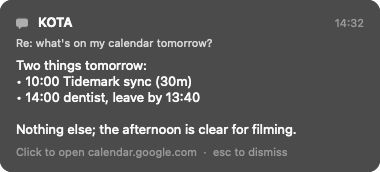
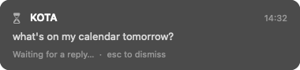

# Messages

The `message` module shows short messages posted to this Mac, usually by an agent on another Mac in your tailnet: a card in a screen corner that does not take focus, a notification, or both. Every message is kept in a history list in the launcher. A [chat window](#chat) holds threaded conversations with KOTA.



```bash
flick message post "Build finished"
flick --host my-laptop message post --title KOTA --url https://github.com/me/repo/pull/2 "PR is up"
```

## Settings

```toml
[message]
name = "KOTA"            # the launcher item, and the card header when a post has no --title
style = "panel"          # panel | notification | both | none (history only)
position = "top-right"   # top-right | top-left | bottom-right | bottom-left | top | bottom
width = 380              # points, 240 to 900
timeout_secs = 20        # 0 keeps the card until dismissed
unprompted_timeout_secs = 0  # how long the card of a post nobody asked for stays; 0 until dismissed
max_cards = 4            # cards shown at once; older ones collapse into a "+N more" pill
max_history = 50         # messages kept outside chat threads
chat_history = 200       # messages kept per chat thread
chat_threads = 20        # chat threads kept (the one with the oldest last message goes first)
sound = true             # a short sound when a message (not a pending one) arrives
hotkey = "cmd+ctrl+alt+shift+KeyM"  # opens the list; unbound by default
card_hotkey = "cmd+ctrl+alt+shift+KeyK"  # moves the keyboard into the newest card (again: back); unbound by default
action_command = ["ssh", "-o", "BatchMode=yes", "-o", "ConnectTimeout=5", "jaymin@mbp-server", ".dotfiles/home/.local/bin/kota-ask"]
pending_timeout_secs = 120  # a sent press waiting this long for KOTA shows "No update from KOTA"; 0 waits
card_timeout_secs = 0       # how long an open card with actions stays; 0 until acted on or closed
chat_hotkey = "cmd+ctrl+alt+shift+KeyJ"  # shows or hides the KOTA chat window; unbound by default
kota_host = "jaymin@mbp-server"          # where a chat question goes (ssh target)
kota_ask = ".dotfiles/home/.local/bin/kota-ask"  # kota-ask on that host, relative to its home
attach_dir = ".cache/flick/attach"       # where chat screenshots go on kota_host, relative to its home
```

All keys are optional; the values above are the defaults except `name` (default `Messages`), `hotkey`, `card_hotkey`, `chat_hotkey` (unbound: no chat) and `action_command` (default empty: card presses that reply show an error naming the key).

## The card

- Each message is its own card, keyed by its id: posting (or `show`ing) an id that already shows redraws that card in place, without a sound; a new id stacks a new card nearest the `position` corner, older ones moving away from it. At most `max_cards` show; the rest wait in a `+N more` pill and come back as cards close. The stack sits on the screen under the pointer when its first card appeared, and stays there until it empties; it is above other windows and on every Space.
- It never activates Flick and takes the keyboard only when you click one of its text fields or use `card_hotkey` (see [Keyboard](#keyboard)), so typing stays in the app you are using.
- **Click** opens the post's `--url` (http and https only) and dismisses the card; without a link, a click just dismisses it. The **x** in the top right corner just closes it. **Esc** dismisses every card from any app (except while a card has the keyboard: then Esc only gives it back); that needs Accessibility for Flick (without it, use a click or the timeout). Each card hides after its own `timeout_secs`, later if the pointer rests on it. The time runs only while you are at the Mac: if there was no keyboard or mouse input since the card showed (you were away, the screen was locked or the display asleep), or the Mac slept, it stays until you are back and then gets its full time again.
- The body is plain text with light markdown cleanup: `**`, `__` and backticks dropped, `#` headings and `-`/`*` bullets as plain lines and `•`, `[text](url)` as `text (url)`. The card shows up to 18 lines; the list has the full text.
- `style = "notification"` or `"both"` also posts a macOS notification (needs notification permission; clicking it does nothing yet).

## Unread posts

A post nobody asked for, `message post` without `--reply-to` (and not `--pending`, `--partial` or in a chat thread), is unread until you see it. KOTA's unprompted nudges are such posts.

- Its card stays until you close it (`unprompted_timeout_secs`, default 0). Esc closes it like any message card.
- Closing its card (x, a click, Esc) reads it. So does opening the message list (the launcher item, `hotkey`, or Inbox in the KOTA menu): rows read that way show `Unread` in that list, and their corner cards close. A timeout, `message hide` or a restart leave it unread.
- The KOTA menu bar badge counts unread posts with the cards waiting on you. `flick events` sends `{"event":"cards_pending","count":<cards>,"unread":<posts>}`.
- `message ls` marks it `(unread)`; `ls --json` has `"unread": true` (absent when read). A peer can check whether its post was seen.
- Replies (`--reply-to`), placeholders and chat posts behave as before: `timeout_secs`, never unread.

## Pending posts and replies

A post with `--pending` is a placeholder: an hourglass, a dimmed body, "Waiting for a reply…", no sound and no notification. A later post with `--reply-to <its id>` removes it from history and its card, and shows the reply with a `Re: <placeholder body>` line.



`k <text>` (Ask KOTA) uses this: the script posts `--pending` locally, sends the text and the id to KOTA, and KOTA answers with `flick --host <this Mac> message post --reply-to <id> ...`. A `--reply-to` naming a message that is not pending keeps that message and quotes it.

## Cards

A card is a message with structure, posted as JSON. The schema, the action vocabulary, the press round trip and examples are in [cards.md](cards.md), the spec KOTA reads with `flick --host <mac> message card spec`; this section is the user side. It shows as a card with its title, blocks (text, key/value rows, lists, progress, choices, fields) and action buttons. Text blocks render markdown-lite styled: bold, italic, `code`, fenced code, headings, bullets and links. It is stored in the same history as its plain text (the `message:<id>` row and `ls` show that text).

```bash
printf %s "$json" | flick --host my-laptop message card post --stdin   # or: message card post '<json>'
```

- Posting the same `id` again replaces the card in place. `reply_to` (a pending message id) replaces that placeholder, as `post --reply-to` does.
- A card in state `open` with an enabled action stays for `card_timeout_secs` (default: until closed; Esc leaves it); a `pending` card (the hourglass, without sound or notification) stays until it is updated or closed; other cards hide after `timeout_secs`.
- A card you dismissed (`card dismiss`, its x or Esc) comes back only when re-posted as `open` or `error`; a `done` or `pending` update of it goes to history silently. A card that only timed out shows any update. Dismissals are stored, so they hold across a restart (and a dismissed card stays out of the KOTA badge).

### Presses

- An action without `do` (or with `"reply": true`) replies to KOTA: Flick runs `action_command` with `--action --card <id> --action-id <action id>` appended and the card's field and choice values as a JSON object on stdin (`{"<input id>": "text" | "option id" | null | ["option id", …]}`), on a background thread, killed after 20 s. The card shows "Sent to KOTA…" with its actions off while it runs.
  - Exit 0: the card stays pending until KOTA posts the same id again (which redraws it and clears the pending state). If no update comes within `pending_timeout_secs`, the card shows "No update from KOTA" and its actions come back.
  - Exit 2: the card shows "KOTA rejected: <last stderr line>"; other exits, a timeout or a command that cannot start show an error line. Either way the actions come back, so you can retry.
  - Presses on a pending or `done` card are ignored, so a press is never sent twice and a finished card never runs an action again; `open` and `error` cards take presses. Without `action_command` a press shows "Set [message] action_command to send presses to KOTA".
- `"do": "dismiss"` closes the card (with `"reply": true`, after the press reaches KOTA). Other local actions run on this Mac when pressed, checked again at press time against where the card came from (a card from a peer may not run a `flick` verb peers may not send):
  - `open_url`, `open_app` (a name or bundle id) and `copy` run at once; the card shows a short line ("Opened the link", "Opened Safari", "Copied").
  - `script` (`flick script run <name> [query]`) and `flick` (any request, e.g. `["task","start","x"]`) run Flick's own binary as a command line client in the background, killed after 30 s; the card shows "Running …", then the last line of the reply, or an error line. For a peer's card the request is marked `--remote`.
  - `shell` never runs on the first press: the card shows the exact command with Cancel and Run. Run executes it with `/bin/sh -c` in your home folder, killed (with what it started) after 60 s; the card shows the last output line or "command failed (exit n): <last stderr line>". Output is never stored.
  - With `"reply": true` the local part runs first; if it works, the press is sent to KOTA as above. If it fails, the card shows the error and nothing is sent.
- Pending, error and confirm states live in memory only.
- Any press (a click, Space on a focused button, ⌘1..⌘6, ⌘↵) gives the keyboard back to the app you were in, also after typing in one of the card's fields.
- Invalid JSON, a card over 16 KiB, or a missing/invalid `id`, `title`, `v` or `state` is an error reply `invalid card: <reason>` (exit 1); nothing is shown or stored. Anything else is shown as well as it can be, with a warning.
- Cards posted over the network are marked remote: a `flick` action naming a verb peers may not send is shown disabled.

### Keyboard

`card_hotkey` (or `flick message card focus`) moves the keyboard into the newest card without activating Flick: the app you are in stays active (its menu bar stays), only the typing goes to the card, its first field or button focused. Clicking a field in a card does the same for that card.

| Key | In a card that has the keyboard |
| --- | --- |
| Tab / Shift-Tab | next / previous field, choice or button (wraps) |
| Space | press the focused button, toggle the focused choice |
| ⌘1 … ⌘6 | press action 1 … 6 (a disabled one does nothing) |
| ⌘↵ | press the primary action (the first enabled `"style": "primary"`) |
| ⌥↑ / ⌥↓ | move the keyboard to the card above / below |
| Esc | give the keyboard back; the card stays (Esc never dismisses a card that has the keyboard, even one Esc would dismiss from another app) |
| ⌘X ⌘C ⌘V ⌘A ⌘Z | edit the focused field |

`card_hotkey` pressed again also gives the keyboard back, as does any press and closing the card. In a shell confirm step ⌘n and ⌘↵ do nothing: Tab to Run and press Space, or click it.

## Launcher

- **Messages** (or your `name`) in root search shows the latest message as its subtitle; Enter opens the list.
- In the list, newest first: Enter copies the message's text. ⌘K: **Show in Panel**, **Open Link** (with a link) and **Copy Message**.
- ⌘K on the root item: **Chat Threads**, the chat threads newest first; Enter opens the chat window on one.

## Chat

A floating window for a conversation with KOTA: threads, a transcript of markdown-lite bubbles, KOTA's cards inline with working buttons, streaming replies, and context from the app you were in. Chat is part of this module because KOTA's replies and cards land in its store.

Chat is off until you set `chat_hotkey`:

```toml
[message]
chat_hotkey = "cmd+ctrl+alt+shift+KeyJ"  # shows or hides the chat window; unbound by default
chat_history = 200                       # messages kept per thread
chat_threads = 20                        # threads kept (the one with the oldest last message goes first, all of it)
kota_host = "jaymin@mbp-server"          # ssh target a question goes to
kota_ask = ".dotfiles/home/.local/bin/kota-ask"  # kota-ask on that host, relative to its home
attach_dir = ".cache/flick/attach"       # where screenshots go on kota_host, relative to its home
```

The values shown are the defaults, except `chat_hotkey`. `chat_history` and `chat_threads` must be at least 1. `kota_ask` and `attach_dir` take only `A-Z a-z 0-9 . _ / -` (`kota_ask` also `~`). `attach_dir` may not have a `.` or `..` part or a part that starts with `-`. A bad value fails the config load with a `[message]` error.

### Summon and hide

- `chat_hotkey` shows the window on the screen under the pointer, with the caret in its input. Flick never activates, so the app you were in stays active and keeps its menu bar. Only your typing goes to the chat.
- Esc, ⌘W or the hotkey again hides the window. The app you were in gets the keyboard back if it is still in front. If the window shows but another app has the keyboard, the hotkey gives the keyboard back to the chat.
- You can resize and move the window by its background. It remembers its frame. It floats above other windows and shows on every Space.
- `flick message chat [--thread t]` and **Chat Threads** (⌘K on the **Messages** root item, then Enter on a thread) also open it, and so does **Open Chat** in the [KOTA](kota.md) menu bar item and the Ask KOTA view.

### Keys

| Key | In the chat window |
| --- | --- |
| Return | send the question |
| ⇧Return | new line |
| ⌘N | start a thread |
| ⌘[ / ⌘] | the thread with the next older / newer last message |
| ⌘R | send the thread's newest question again if it did not go out |
| ⌘⇧V | attach the clipboard text |
| ⌘⇧S | attach a screenshot of the display under the pointer |
| ⌘W, Esc | hide the window |
| ⌘X ⌘C ⌘V ⌘A ⌘Z | edit the input |

### Threads

- The window shows, in order: the thread you asked for, the one it showed last, the newest stored thread, or a new one.
- A new thread (`t` plus a base-36 time) is stored once its first question is.
- The header title is the thread's first message, clipped to 48 characters (`New chat` while empty).
- The subtitle under the title gives the state:
  - idle: the key hints;
  - `KOTA is on it…`: a question is waiting, or a reply is pending or streaming;
  - `Last question not sent · ⌘R retries`.
- Day dividers (`Today`, `Yesterday`, `Oct 9`) split the transcript. Your bubbles are on the right, KOTA's on the left under its `--title` or `[message] name`.
- History survives a restart. Each thread keeps `chat_history` messages, and the store keeps `chat_threads` threads. Chat never evicts the unthreaded corner history (`max_history`).

### Asking

1. Return stores your question at once as your bubble, with "Thinking…" under it. A question is trimmed and must be 1 to 2000 characters. An empty or longer one is refused, and the text and its chips stay in the input.
2. A worker sends the question to KOTA (below). Questions go one at a time, in the order you typed them.
3. If the ssh fails or kota-ask exits non-zero, the bubble is marked `Not sent · ⌘R retries`, and the reason shows on the notice line under the transcript. ⌘R sends it again under the same id, with the same chips. Chips are kept for the last 4 failed questions.
4. "Thinking…" goes when KOTA posts into the thread, or when the question is 10 minutes old without an answer.

`flick message ask [--thread t] <text...>` asks the same way, from a terminal. It uses the window's thread without `--thread`, sends no chips, and answers when the ssh is done (`Asked KOTA (<req>)` or `message ask: <why>`).

### Context chips

Chips above the input show what the next question carries besides its text. Nothing goes without its chip showing, and clicking a chip removes it.

- **At summon** (from hidden), the window reads the app in front and adds a chip for each of its name and bundle id, its focused window title, and its selected text. These are on by default, and a new summon replaces every chip. The selection is read through Accessibility (the focused element's `AXSelectedText`, 0.2 s timeout), never with a synthetic ⌘C, so the clipboard is untouched. A secure text field gives nothing. Without Accessibility there is no window or selection chip.
- **⌘⇧V** adds the clipboard text as one chip, replacing an earlier clipboard chip. A concealed or transient clipboard (password managers) counts as empty: the notice says "The clipboard holds no text".
- **⌘⇧S** hides the window, captures the display under the pointer to a temporary PNG, and shows the window again, so KOTA does not see the chat in the shot. The PNG is held in memory and the temp file deleted at once. A question takes at most 3 screenshots of at most 32 MB each.
  - Without Screen Recording, Flick asks macOS for it once per run (macOS shows its prompt only if it has not asked before). The notice says: "Screen Recording is off for Flick: allow it in System Settings > Privacy & Security > Screen Recording, then restart Flick".
- On Return the chips go with the question and are cleared.

### Cards inline

- A card whose `thread` is set (or that inherits one, see below) shows in that thread's transcript as a row, with its blocks, fields and buttons.
- While the window shows that thread, the card does not show in the corner.
- A press works as it does on a corner card ([Presses](#presses)), through the same dispatch and `action_command`. The card shows "Sent to KOTA…" until KOTA re-posts it, then redraws in place.
- Presses on a pending or `done` card do nothing.
- A card is keyed by its id: re-posting it updates the row in place and keeps what you typed in its fields unless the update changed them.

### Corner cards and sound

- Your own questions never alert.
- While the window shows a thread, posts and cards to that thread show no corner card and play no sound. A corner card already up for one only redraws.
- Other threaded posts show a corner card on the first post of an id and on the final one, and sound only on the final one (`--partial` re-posts are silent).
- Unthreaded posts behave as before.

### KOTA side

What mbp-server (or any agent) runs and must send.

**The ask.** Flick runs, with the composed question on stdin and never in argv:

```text
/usr/bin/ssh -o BatchMode=yes -o ConnectTimeout=8 <kota_host> <kota_ask> --id <req> --thread <t>
```

- The budget is 20 s.
- Exit 0 means delivered. Any other exit, a timeout, or a failed connection marks the question not sent. On exit 2 the notice says `Not sent: KOTA rejected: <last stderr line>`.
- `<req>` is the question's message id and `<t>` the thread id. Both are 1 to 64 characters of `A-Z a-z 0-9 . _ -`.
- ssh needs key login to `kota_host`, because BatchMode never prompts.

**The `[context]` block.** When chips are attached, stdin is the question, a blank line, then:

```text
[context]
app: Safari (com.apple.Safari)
window: Inbox - Fastmail
screenshot: ~/.cache/flick/attach/k1abc-1.png
selection:
  every line of the text,
  indented by two spaces
clipboard (cut):
  …
[/context]
```

- Items come in chip order, each at most once.
- One-line items (app, window, screenshot) are flattened and cut to 256 bytes.
- Text items (selection, clipboard) are indented by two spaces, so text cannot close the block early. Each is cut to 4 KiB and marked `(cut)`.
- The whole block is at most 8 KiB, tags included. An item with no room left becomes `<key>: (omitted: context limit)`.
- A composed ask always fits kota-ask's 16 KiB stdin read.

**Screenshot upload.** Before kota-ask runs, in the same worker job, each screenshot `n` (from 1, in chip order) goes up in one ssh call, with the PNG on stdin and a 30 s budget:

```text
/usr/bin/ssh -o BatchMode=yes -o ConnectTimeout=8 <kota_host> \
  "mkdir -p <attach_dir> && cat > <attach_dir>/<req>-<n>.png && find <attach_dir> -type f -name '*.png' -mtime +7 -delete"
```

- The call creates the dir, writes `~/<attach_dir>/<req>-<n>.png` (the path the `[context]` block names), and deletes screenshots there older than 7 days.
- A failed upload fails the question (`screenshot upload failed: …`), and kota-ask does not run.
- ⌘R uploads again to the same paths.

**The reply.** KOTA answers on the laptop with:

```bash
flick --host <laptop> message post [--thread <t>] --reply-to <req> --id <x> [--partial] [--title KOTA] -- <text>
```

- **Thread inheritance.** A post or card without `--thread` (or `thread`) goes in the thread its own id is already stored in, else in the thread of the message `--reply-to` names. So `--reply-to <req>` alone lands the reply in the question's thread.
- **The question stays.** A question is never `pending`, so `--reply-to <req>` keeps it and the reply shows below it.
- **Streaming.**
  - Post the same `--id <x>` with `--partial` and the text so far, as often as needed, then once more without `--partial` when the text is complete.
  - One bubble updates in place and keeps its first time and place. It shows a streaming indicator until the final post.
  - `--partial` with `--pending` is an error.
- **Cards.** A card answer is `message card post` with `"thread": "<t>"` (or `"reply_to": "<req>"` to inherit it); see [cards.md](cards.md). Presses come back through `action_command` (`kota-ask --action --card <id> --action-id <id>`, values JSON on stdin), as for corner cards. KOTA acknowledges a press by re-posting the card.
- **Thread ids** come from Flick (`t…`). KOTA may also post into a thread id of its own choosing with `--thread`. That starts a thread the window lists.

**Known limits on the KOTA side** (seed flick-859d):

- `kota-ask` drops control characters, turns every whitespace run (newlines included) into one space, and caps the prompt at 2000 characters. On mbp-server the `[context]` block arrives on one line, and a long question plus context is cut.
- `kota-flick-say` has no `--thread` or `--partial` yet. Its `--reply-to <req>` reply still lands in the question's thread (inheritance). But each reply is a new post with a new id, so there is no streaming.

### Network

`message chat` and `message ask` are refused over the network (`NET_DENIED`): a peer must not open a window that takes this Mac's keyboard, or make this Mac ssh. `message threads` and `message thread <t>` are read-only and allowed, as are `post --thread/--partial` and `card post`.

### Chat smoke checklist

On the laptop against live KOTA, with `chat_hotkey` set and Flick reloaded.

- [ ] **Summon.** In TextEdit, press `chat_hotkey`. The window shows under the pointer with the caret in its input, and the menu bar still says TextEdit. Esc hides it, and typing goes straight back to TextEdit. The hotkey shows it again, and the hotkey once more hides it. ⌘W hides it too.
- [ ] **Ask.** Type a question and press Return. Your bubble shows at once with "Thinking…" under it, and the subtitle says `KOTA is on it…`. KOTA's reply appears in the same thread without reopening the window, and no corner card or sound comes while the window shows the thread.
- [ ] **Not sent.** Set `kota_host = "nobody@invalid"`, reload and ask. The bubble says `Not sent · ⌘R retries` and the reason shows under the transcript. Restore the host, reload, open the thread, and press ⌘R: the question goes out.
- [ ] **Streaming.** From mbp-server, run `flick --host <laptop> message post --thread <t> --id s1 --partial "Hel"`, then `... --partial "Hello wor"`, then `... "Hello world"` (no `--partial`). One bubble updates in place with a streaming indicator that clears on the last post.
- [ ] **Inheritance.** `flick --host <laptop> message post --reply-to <req> "inherited"` (no `--thread`) lands in the question's thread.
- [ ] **Threads.** ⌘N starts an empty `New chat`. ⌘[ and ⌘] walk older and newer threads. ⌘K on **Messages** > **Chat Threads** lists them, and Enter opens one. Quit and restart Flick: the threads are still there, and `flick message ls` still lists the unthreaded history.
- [ ] **Chips from Safari.** In Safari, select some text on a page and press `chat_hotkey`. Three chips show: Safari, the window title, and the quoted selection. Click the window-title chip: it goes. Ask "what did I select?". KOTA's prompt carries a `[context]` block with app and selection, and the clipboard is unchanged.
- [ ] **⌘⇧V.** Copy some text, open the chat, and press ⌘⇧V: a `Clipboard` chip shows. Press it again after copying something else: still one chip. With a password manager's concealed copy, the notice says "The clipboard holds no text".
- [ ] **⌘⇧S.** Press ⌘⇧S. The window hides for the shot, comes back, and a `Screenshot` chip shows. Ask. On mbp-server, `ls ~/.cache/flick/attach` has `<req>-1.png` showing the display without the chat window, and the `[context]` block names `~/.cache/flick/attach/<req>-1.png`. A fourth ⌘⇧S on one question says "At most 3 screenshots per question".
- [ ] **Screen Recording prompt.** With Screen Recording off for Flick, press ⌘⇧S. the notice says how to grant it, and macOS shows its permission prompt if it never asked before. A second ⌘⇧S shows only the notice, never a second prompt. Grant it, restart Flick, and ⌘⇧S works.
- [ ] **Inline card.** From mbp-server, post a card with `"thread": "<t>"` and a reply action. It shows inline in the open thread, not in the corner. Press the action: "Sent to KOTA…". KOTA's re-post of the card redraws it in place. Re-post it as `"state": "done"` and press again: nothing happens.
- [ ] **Network.** From a peer, `flick --host <laptop> message chat` and `message ask x` are refused, and `message threads --json` answers.

## Commands

```bash
flick message post [--title t] [--url https://…] [--reply-to id] [--id id] [--thread t] [--pending|--partial] [--] <body...>
flick message ls [--limit n]     # <id>\t<time>\t<title: >body[ (pending|partial|failed)], newest first (--json: the records)
flick message threads [--limit n]  # <thread>\t<time of last>\t<n> messages\t<first body>, newest first (--json: [{id,messages,first_ts,last_ts,first_body}])
flick message thread <t> [--limit n]  # the thread's newest n messages, oldest first, as ls prints them (--json: the records)
flick message chat [--thread t] [--snapshot <png>]  # show the chat window (on thread t); --snapshot draws it into a PNG (this Mac only)
flick message ask [--thread t] <text...>  # ask KOTA in the chat (default: the window's thread); answers once ssh is done (this Mac only)
flick message show [id]          # show a message (default the latest) in the card again
flick message hide               # dismiss every card
flick message card post <json>|--stdin   # the card id, then one "warning: …" line per warning
flick message card get <id>      # the stored (normalized) card JSON
flick message card ls [--limit n]  # <id>\t<time>\t<state>\t<title>, newest first (--json: [{id,ts,remote,card}])
flick message card show <id>     # show the card again
flick message card dismiss <id>|--all  # remove the card (every card)
flick message card spec          # print the card spec (docs/cards.md, built in)
flick message card press <id> <action> [values-json]  # press a button as a click does (this Mac only)
flick message card focus         # move the keyboard into the newest card, as card_hotkey does (this Mac only)
```

`card press` takes the same path as a click: values default to the card's initial field and choice values, and it answers what happened (`Sent go to KOTA…`, `Running script deploy…`, `Copied`, `Closed c1`) or the refusal. On a `shell` action the first `card press` shows the confirm on the card (and prints the command); a second `card press` of the same action is Run, and `card press <id> :cancel` is Cancel.

`card post --json` answers `{"id":"…","replaced":true|false,"warnings":["…"]}`; `replaced` is true when a card with that id existed or `reply_to` took a pending message. The client exits 1 when Flick answered with an error (fix the card) and 3 when it got no reply (Flick unreachable).

`post` prints the message id (generated unless `--id`; ids are 1-64 of `A-Z a-z 0-9 . _ -`); with `--json` it answers `{"id":"…","replaced":true|false}`. The body is the words after the flags joined by spaces, at most 16 KiB; put `--` before a body that starts with `--`.

**Threads and streaming** (for the [chat window](#chat)). `--thread <t>` (an id as above) files the post in conversation `t`; a card's `thread` does the same. `--partial` marks a reply that is still streaming: post the same `--id` again with the text so far, and once more without `--partial` when it is complete. A partial post redraws its card in place with no sound and no notification; the final one plays the sound and notifies as any post. `--partial` and `--pending` together are an error. Re-posting an id that is in a thread or partial keeps its original time and place (and its thread, if the re-post has no `--thread`); re-posting any other id makes it new, as before. A new post without `--thread` that names a `--reply-to` in a thread joins that thread. Unthreaded history keeps `max_history` messages, each thread `chat_history`, and `chat_threads` threads; chat never evicts unthreaded history. `--json` messages carry `thread`, `role` (`"me"` for what you typed in the chat) and `state` (`"partial"` or `"failed"`) only when set. `thread <t>` for a thread with no messages is the error `No thread <t>` (exit 1).

**Network.** Peers in `[remote] peers` may send every `message` verb (including `card spec`, `threads` and `thread`) except `card press`, `card focus`, `chat` and `ask` (a peer must not open a window that takes this Mac's keyboard or make this Mac ssh): posting is the point of the module. A post can only show text and offer an http(s) link that you click.

## Manual tests

1. `flick message post "hello"`: a card shows top right without taking focus from the front app (keep typing in it), plays a sound and hides after 20 s.
2. `flick message post --url https://example.com "click me"`, click the card: the browser opens example.com and the card hides.
3. Post again and press Esc in another app: the card hides. Click a card's x: only that card closes. Post with `timeout_secs = 0` set and reload: it stays until dismissed.
4. `flick message post --pending --id t1 "question?"` then `flick message post --reply-to t1 "answer"`: the hourglass card is replaced by the answer with `Re: question?`; `flick message ls` lists only the answer.
5. Set `position = "bottom-left"`, `style = "both"`, reload, post: the card is bottom left and a notification shows.
6. Open **Messages** in the launcher, press Enter on a row: the footer says Copied message and the text is on the clipboard. ⌘K **Show in Panel** shows it again.
7. Post five messages with different `--id`s: four cards stack from the corner, newest nearest it, with a `+1 more` pill; close one and the hidden card appears. Post one of the ids again: that card redraws in place, no sound.
8. From a peer: `flick --host <this Mac> message post --title KOTA "from the server"` shows the card.
9. `printf %s '{"id":"c1","title":"Deploy?","blocks":[{"type":"text","md":"Ship **v2**"}],"actions":[{"id":"go","label":"Ship"}]}' | flick message card post --stdin`: a card "Deploy?" with "Ship v2" and "[Ship]" stays (Esc does not close it). Post it again with `"state":"done"`: it redraws in place and hides after `timeout_secs`. `flick message card post '{"id":"x"}'` prints `flick: invalid card: …` and exits 1.
10. Set `action_command = ["/bin/sh", "-c", "cat > /tmp/press.json; echo \"$@\" >> /tmp/press.json", "sh"]` and reload. Post a card with a field and a `Ship` action without `do`, type in the field and press Ship: the card shows "Sent to KOTA…", `/tmp/press.json` holds the values JSON and `--action --card <id> --action-id ship`. Re-post the card: it redraws with Ship enabled. With `pending_timeout_secs = 10`, press again and wait: "No update from KOTA" shows. With `exit 2` in the script (writing a line to stderr first), the card shows "KOTA rejected: <that line>".
11. Post a local card with actions `{"do":{"open_url":"https://example.com"}}`, `{"do":{"open_app":"Calculator"}}`, `{"do":{"copy":"hello"}}`, `{"do":{"flick":["task","ls"]}}` and `{"do":{"shell":"echo hi; sleep 1; echo bye"}}`. Each press works and leaves a short line; the flick one shows the request's last reply line; the shell one shows the command, runs only on Run, shows "Running command…" for a second and then "bye". Typing in the front app keeps working throughout. A shell `sleep 90` shows "command took over 60 s; stopped" and leaves no `sleep` process.
12. From a peer, post a card with `{"do":{"flick":["reload"]}}`: the button is disabled with "flick: reload: not allowed over the network"; `flick message card press <id> <action>` prints the same refusal.
13. Set `card_hotkey`, reload, post a card with a field, a choice and two actions (one `"style":"primary"`) from a terminal, then click into another app (e.g. TextEdit) and type. Press `card_hotkey`: the menu bar still shows TextEdit, the card's field has the cursor. Tab/Shift-Tab walk the field, the choice and the buttons; ⌘2 presses the second action; ⌘↵ the primary. Press `card_hotkey` again (or Esc): typing goes to TextEdit again and the card stays. With two cards, ⌥↓ (top corner) moves the keyboard to the older card.
14. Click into the card's field (TextEdit stays active in the menu bar), type, press Esc: the card stays (an action card, and also a card without actions) and typing goes back to TextEdit. Click the field again, type, then click a button: the press happens and typing goes back to TextEdit without another click.
